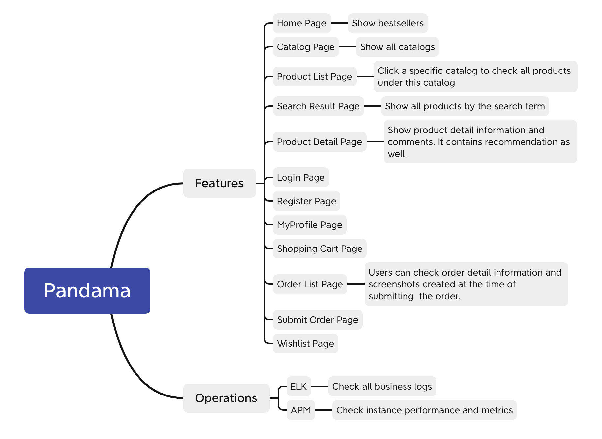
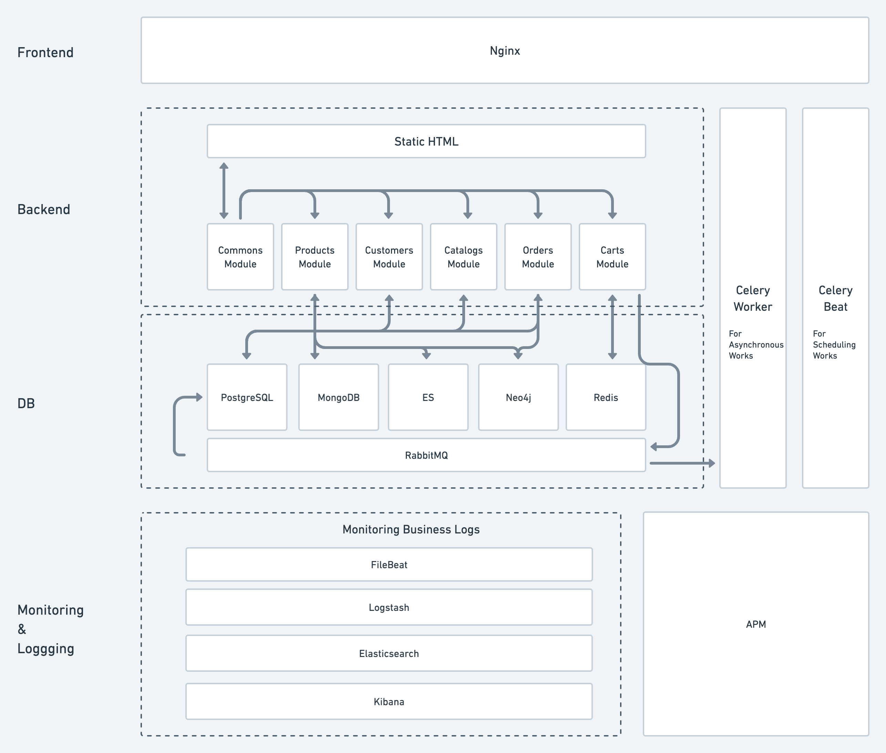

<space><space>
<space><space>

## Website Preview

## Vision

As Chinese students, we hope to buy all kinds of Chinese goods in Pittsburgh. Usually, we choose to buy at Lotus Supermarket, but the online shopping platform of Lotus is not good. When purchasing various daily necessities and food, we found that there were various problems in the interface of the Lotus website. For example, its recharge button may fail. If you click the button several times in a row, you will be charged more than once. Its account management is also very problematic, and the password of an account can be changed without verification. Our group wants to build a shopping platform like Lotus supermarket to provide groceries for Chinese students.

## The meaning of the project name

Pandama = Panda + ma. "Panda" is the symbol of China, it represents the Chinese featured products on our websites. The pronunciation of "DaMa" is the same as the Chinese character "大妈" which means the grandmother in English. The name gives homesick Chinese students a feeling of sweet home and their own lovely grandmother. So, visiting the Pandama is just like coming back home and taking a tasty dinner made by your grandmother.

## Features

## Tech Arch

