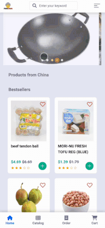

[](https://ninglin-liu.gitbook.io/pandama)<space><space>
<space><space>

## Website Preview



## Vision

As Chinese students, we hope to buy all kinds of Chinese goods in Pittsburgh. Usually, we choose to buy at Lotus Supermarket, but the online shopping platform of Lotus is not good. When purchasing various daily necessities and food, we found that there were various problems with the interface of the Lotus website. For example, its recharge button may fail. If you click the button several times in a row, you will be charged more than once. Its account management is also very problematic, and the password of an account can be changed without verification. Our group wants to build a shopping platform like Lotus supermarket to provide groceries for Chinese students.

## The meaning of the project name

Pandama = Panda + ma. "Panda" is the symbol of China, it represents the Chinese featured products on our websites. The pronunciation of "DaMa" is the same as the Chinese character "大妈" which means the grandmother in English. The name gives homesick Chinese students a feeling of sweet home and their own lovely grandmother. So, visiting the Pandama is just like coming back home and taking a tasty dinner made by your grandmother.

## Contributors

This project came from my team project in CMU course 17637 taught by Jeffrey Eppinger and Sujata Telang, team members are shown below. And later I add more monitoring features and docker configuration into this project.

| Name          | Department                    | Contributions                                  |
| ------------- | ----------------------------- | ------------------------------------------ |
| Ninglin Liu   | CMU Heinz College - MISM      | Lead Team / Develop / Deployment / Docker Configuration |
| [Jianbing Gong](https://github.com/JianbinGong) | CMU Heinz College - MISM      | Develop |
| [Shu Wu](https://github.com/Sukeastree)        | CMU Heinz College - MISM      | Develop      |
| [Xiaoting Wang](https://github.com/makethedayunique) | CMU Heinz College - MISM BIDA | Develop |

## Acknowledgement

All product data crawled from [Lotus Food](https://www.lotusfoodonline.com/#/home).

## Future Works

- Transform to Django REST framework
- Using Kubernetes to implement a microservices architecture
- Deploy apps into Kubernetes cluster in AWS
- Add management features
- (Optional) Try Service Mesh

## Features


## Tech Arch


## Getting started

Steps for Running Pandama in Local Docker:
1. Configuration
   1. Put your custom env file under the env folder
   2. Set your secret key and access key for your AWS account
   3. Change your S3 access URL
2. Run by docker compose
   ```bash
   docker-compose up
   ```
   
3. Create products from Pittsburgh chinese lotus online store
   ```bash
   curl -x POST localhost/operation/spider_execute
   ```
4. Access Pandama with the mobile mode in the browser(Chrome)
   ```
   http://localhost
   ```
5. Stop docker compose
    Click "Ctrl" + "C" to force stop, then type the commands below
    ```bash
    docker-compose down
    ```
    

## URL for Pandama

- Pandama webiste
  - http://localhost
- Kibana / APM
  - http://localhost:5601
- PostgreSQL
  - port: 5432
  - username: pandama
  - pass: pandama
  - db: pandama
- Redis: 
  - port: 6379
  - auth: pandama
- MongoDB
  - port: 27017
  - username: pandama
  - pass: pandama
  - db: pandama
- Neo4j: 
  - http://localhost:7474/browser
  - auth: neo4j/pandama
- Elasticsearch
  - port: 9200
  - pass: pandama
- RabbitMQ: 
  - http://localhost:15672/